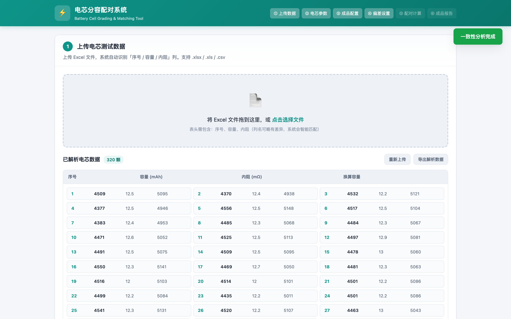

# PackForge · 电芯分容配对系统

一款纯前端实现的电池电芯分容配对工具。上传电芯测试数据（序号 / 容量 / 内阻）并填写测试参数后，系统自动换算每颗电芯的满容量，完成一致性分析、成品电池配置、配对计算与报告导出。

你可以访问这个链接直接使用：[网页链接](https://battery.malu.tech/)



---

## 功能特性

- **Excel 数据上传**
  - 支持 `.xlsx / .xls / .csv` 格式
  - 自动识别「序号 / 容量 / 内阻」列，列名可略有差异
  - 已解析电芯数据以 4 列网格展示（序号 / 容量 / 内阻 / **换算容量**），换算容量为系统按测试参数自动计算的满容量
  - 满容量换算：根据「容量测试·起始电压 / 截止电压 / 放电倍率 (C)」参数，系统自动将实测容量换算为标准满容量，并自动换算显示对应电流 (A)

- **电芯一致性分析**
  - 容量、内阻的均值 / 标准差 / 极差 / 偏差率统计
  - 容量分布图、内阻分布图
  - 基于 2σ 原则给出「建议剔除」电芯清单，支持一键自动剔除

- **成品电池配置（双模式）**
  - 方式一：按目标电压 + 容量，自动计算串并联数
  - 方式二：按串并联数，反推实际电压、容量、能量
  - 额定最大放电 / 充电 / 容量测试放电均支持按 C 倍率输入，系统自动换算并显示对应电流 (A)

- **配对计算（两种模式）**
  - **均衡优先**：LPT 贪心分配，最小化串间容量偏差
  - **达标优先**：每串必须满足用户设置的偏差范围，无法配满时给出缺口电芯数量及要求；其下提供**次级目标**开关——
    - **串间均衡优先（默认）**：在严格保持每串达标的前提下，通过约束内交换拉平各串均值、降低串间偏差
    - **串内一致性优先**：维持逐串最优结果，串间偏差可能略大
  - **配对清单改为串内标签页**：20+ 串时每串一个标签页（带状态点：绿=达标 / 黄=偏差 / 红=严重）+ 末尾「未使用」页，横向滚动切换，只展示当前选中串，避免长表拖长页面
  - 输出每串电芯清单、串间偏差表、未使用 / 多余电芯列表
  - 支持导出 Excel 配对表

- **大电池报告**
  - 大电池电压、容量、能量、串并联数
  - 保护板不同截止电压下的预估容量（系统根据测试参数自动换算）
  - 达标率与偏差统计
  - **质量评估基于分布形态**：评级采用「中间 90% (P5~P95) 跨度」+「集中率」双指标，少数离群电芯不拖低整体一致性评级；内阻分布精确到小数点后 1 位

- **偏差范围设置**
  - 场景预设：动力 / 储能 / 电动工具 / 备用电源
  - 手动修改后自动切换为「自定义」
  - 串内容量偏差、串内内阻偏差、串间容量偏差、串间内阻偏差可独立设置

- **电池知识区**
  - 内置常见电池化学体系参数与分容配对注意事项

---

## 使用流程

1. 打开网页，在区块①「上传电芯数据 & 参数设置」中上传 Excel 文件
2. 填写电芯参数（电池类型、额定容量、测试电压、放电倍率等），点击「⚡ 解析并分析电芯」
3. 查看区块②「一致性分析」：已解析电芯数据（**含每颗电芯的系统换算容量**）、整体统计、质量评估与分布图
4. 进入「成品配置」选择配置方式并填写目标参数
5. 进入「偏差设置」选择场景或自定义容差
6. 点击「配对计算」生成配对结果，可导出 Excel（含换算容量列）
7. 在「成品报告」查看大电池基本信息与预估容量

---

## 配对算法说明

本工具提供两种互补的配对策略：

### 均衡优先（默认）
- 采用 **LPT（Longest Processing Time）贪心分配**：电芯按有效容量降序，依次放入当前总容量最小的串
- 完成容量均衡后，在容量差 < 1% 的电芯之间进行局部交换，优化串内内阻一致性
- 适合：对总容量均衡要求高，可接受个别串略超偏差的场景

### 达标优先
- 以用户设置的偏差范围为硬约束，逐串构建
- 每串先筛选容量达标的候选池，再在池内按内阻滑动窗口选出内阻也达标的 P 颗电芯
- 当剩余电芯无法组成下一串达标串时停止，并提示：
  - 已配几串 / 目标几串
  - 还缺几串、几颗电芯
  - 缺口电芯的容量 / 内阻要求范围
- **次级目标（串间均衡）**：构建出全部达标串后，在「交换后两串串内仍达标」的硬约束下，通过局部交换拉平各串均值、降低串间偏差，**达标保证绝不退化**
  - 实测（20S4P，4 种分布）：串内一致性 0 退化，串间内阻偏差下降约 1/3（如 29.5% → 16.3%、26.6% → 17.7%）
  - **串间容量偏差存在理论下限**：当电芯本身的容量分布比容差更散时，各串被迫占据不同的容量带，达标模式下的串间容量偏差下限随之升高——此时只能放宽 `tolCapIn`、增加并联数摊薄差异，或更换部分极端电芯
- 适合：电芯一致性要求严格的场景，宁可不配也不将就

### 如何选次级目标（结合保护板均衡能力）

两个选项的本质区别，取决于保护板能否「事后」修正串间差异：

- **有主动均衡（如 1A 主动均衡）→ 选「串内一致性优先」**
  - 主动均衡能在充电/静置时抹平**串间**（系列之间）的电压/电量差，是硬件可修正项；
  - 它**无法**修正**串内**——同一并联组内 P 颗电芯硬并联，BMS 不能对组内单颗做均衡，组内容量/内阻差只会持续发热、拖累整组容量并加速老化；
  - 因此把算法的"预算"花在硬件够不着的**串内**，串间交给主动均衡即可。达标优先已保证每串达标（串间差被容差上界约束），1A 主动均衡足以快速抹平残留串间差。
- **无主动均衡 / 仅 mA 级被动均衡 → 选「串间均衡优先」**
  - 串间差缺少硬件修正，只能由算法预先压低；
  - 适合要求"出厂即均衡"、或充电策略很少进入均衡窗口的场景。

> 提示：主动均衡均衡的是**电压**而非能量，若某串内电芯容量本身不一致，均衡只能拉齐电压、无法让能量真正相等——这进一步说明**串内一致性是根基**，算法应优先保证它。

---

## 容量换算说明

满容量由系统根据电表（分容柜）的**测试三参数**自动换算，换算结果统一用于一致性分析、配对分配与成品容量预估：

1. **容量测试·起始电压 (V)** —— 放电开始电压（通常为满充电压，如 4.2V）
2. **容量测试·截止电压 (V)** —— 放电终止电压（如 3.0V，注意这是很多分容柜/BMS 的**使用下限**，不是额定容量测试截止点）
3. **容量测试·放电倍率 (C)** —— 测试时的恒流放电倍率，系统自动换算并显示对应电流 (A)

换算分两步：

- **① 电压区间换算**：在 [起始电压 → 截止电压] 区间测得的容量，按电池放电曲线反推到「满充上限 → 最低截止(2.5V)」的满容量。
- **② 放电倍率修正（Peukert 方程）**：将实测放电倍率 (C) 折算到**标准倍率 0.2C（IEC 61960 的 C5，5 小时率）**——电芯额定容量即按 0.2C 恒流放至截止电压测得，故以 0.2C 测得即等于标称容量，无需修正；高于 0.2C 因极化测得偏小 → 往大修正，低于 0.2C 测得偏大 → 往小修正（k≈1.05）。

> 例：2500mAh 标称 18650，0.2C=500mA 恒流放到 2.75V 放出约 2500mAh（官方标称）。若分容柜只放到 3.0V，则实测约 2250mAh，系统换算满容量回到约 **2500mAh**。又如 4500mAh 三元电芯在 4.2V→3.0V、1.1C 下测得，系统换算满容量约 **5445mAh**（电压补回 10% 尾段 + 倍率折算到 0.2C）。

---

## 项目结构

```
battery-pairing/
├── index.html          # 主页面
├── css/
│   └── styles.css      # 样式与响应式布局
├── js/
│   ├── app.js          # 主控制器、UI 交互
│   ├── calc.js         # 统计、一致性报告、成品配置、容量换算
│   ├── pair.js         # LPT 与达标优先配对算法
│   ├── excel.js        # SheetJS 解析 Excel / 导出配对表
│   └── knowledge.js    # 电池知识与化学体系数据
├── docs/
│   └── screenshot.png  # 项目截图
└── README.md           # 本文件
```

---

## 本地运行

无需构建工具，直接在浏览器打开即可：

```bash
# 方式一：用 Python 临时启动本地服务器
cd battery-pairing
python3 -m http.server 8080

# 方式二：直接用浏览器打开 index.html
open index.html
```

> 由于页面使用 SheetJS 通过 JS 读取 Excel，建议通过本地服务器方式打开，避免浏览器文件协议限制。

---

## 技术栈

- HTML5 / CSS3 / 原生 JavaScript（无框架依赖）
- [SheetJS / xlsx](https://sheetjs.com/) 解析 Excel
- 纯浏览器端运行，数据不上传服务器

---

## 浏览器兼容

- Chrome / Edge / Safari / Firefox 最新版
- 推荐使用 Chrome 或 Edge 获得最佳体验

---

## 说明

- 满容量由系统根据「容量测试·起始电压 / 截止电压 / 放电倍率 (C)」三个测试参数自动换算，不再依赖用户手填的换算容量；换算采用电压区间反推（4.2V→3.0V 仅约 90% 满容量，尾段 8%~13%）+ Peukert 放电倍率修正（基准 0.2C / C5）
- 所有计算均在浏览器本地完成，不会上传任何数据

---

## 迭代记录

### v0.9 · 2026-07-20 — 配对清单标签页 + 达标优先串间均衡
- **配对清单改为串内标签页**：20+ 串时每串一个标签页（带状态点：绿=达标 / 黄=偏差 / 红=严重）+ 末尾「未使用」页，支持横向滚动切换，只展示当前选中串，避免长表拖长页面
- **达标优先新增次级目标开关**：
  - 串间均衡优先（默认）：在严格保持每串达标的前提下，通过约束内交换拉平各串均值、降低串间偏差（实测串内 0 退化、串间内阻偏差下降约 1/3）
  - 串内一致性优先：维持逐串最优结果
- 说明达标模式下串间容量偏差存在理论下限（电芯分布越散，下限越高）

### v0.8 · 2026-07-19 — 质量评估分布形态 & 内阻精度
- 质量评估改为基于分布形态评级：「中间 90% (P5~P95) 跨度」+「集中率」双指标，少数离群电芯不拖低整体一致性评级
- 内阻分布精确到小数点后 1 位

### v0.7 · 2026-07-19 — 放电曲线校正
- 修正三元锂 4.2V→3.0V 放出比例（由约 99% 校正为约 90%，尾段 8%~13%）
- 标准倍率基准统一为 0.2C（C5），依据 IEC 61960 / GB/T 35590 及大厂（Samsung 等）产品手册核实

### v0.6 · 2026-07-19 — 上传与参数合并 + 倍率输入
- 「上传电芯数据」与「电芯参数设置」合并为同一区块，设置后展示整体统计与已解析电芯数据，每颗电芯自动带换算容量
- 放电电流 (A) 输入改为放电倍率 (C) 输入，系统自动换算并显示对应电流 (A)
- 容量换算由「用户手填」改为「系统按测试三参数自动换算」

### v0.5 · 初始版本
- Excel 上传（序号 / 容量 / 内阻自动识别，列名容差）
- 一致性分析（统计 / 分布图 / 2σ 自动剔除）、成品电池配置（双模式）、配对计算（均衡优先 LPT / 达标优先）、大电池报告
- 偏差范围场景预设（动力 / 储能 / 电动工具 / 备用电源）、电池知识区

